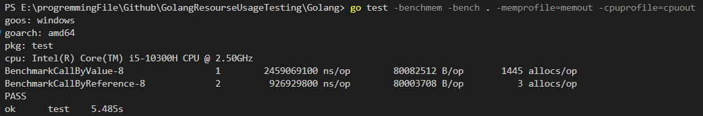
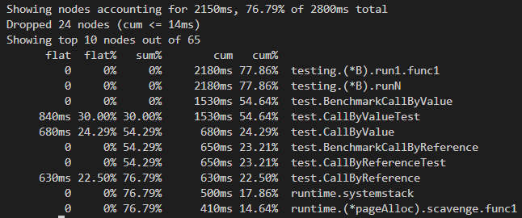
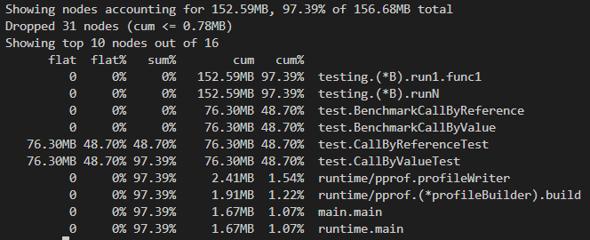

# 深入探討不同語言的 Call by Value/Reference 效能
## 實驗設計
* 在本實驗中，我將會分別使用 Call by Value/Reference 的方式傳遞一個包含 10000000 個元素的陣列的 struct 給一個函式 (模擬傳遞大資料)，共計執行 100 次
* 其中，CallByValueTest() 函式負責呼叫 CallByValue() 函式 100 次，並透過 Call by Value 的方式傳遞大資料作為參數
* 而 CallByReferenceTest() 函式負責呼叫 CallByReference() 函式 100 次，並透過 Call by Reference 的方式傳遞大資料作為參數
* 在這個過程中，紀錄執行時的 CPU/memory 使用情形
* 本實驗預測試的語言為 Golang 以及 Rust

## Golang
* 於本專案的 Golang 資料夾下執行以下指令即可觀察實驗結果 (最好先清除上一次實驗產生的結果)
### 執行 benchmark test
```bash
go test -benchmem -bench . -memprofile=memout -cpuprofile=cpuout
```


* 觀察實驗結果
    * 在執行時間方面，Call by Reference 比 Call by Value 快上約 2.65 倍。由此可知，Call by Reference 的效率較高
    * 在記憶體使用方面，Call by Reference 與 Call by Value 的差異不大。這可能是因為 Call by Value 在函式呼叫結束後，記憶體有被釋放，故總體記憶體使用量沒有太大的差異
    * 在記憶體分配次數方面，Call by Reference 比 Call by Value 少上非常多次。記憶體分配越多次，所消耗的時間也越多，這也進一步體現為執行時間上的差異

### 分析 benchmark test 的 cpu usage
```bash
go tool pprof cpuout
top -cum
```


* 觀察實驗結果
  * CallByValueTest() 直接語句耗時為 840ms, 總耗時為 1530ms
  * CallByReferenceTest() 直接語句耗時為 0ms, 總耗時為 650ms
  * CallByValue() 直接語句耗時為 680ms, 總耗時為 680ms
  * CallByReference() 直接語句耗時為 630ms, 總耗時為 630ms
  * 觀察發現 CallByValueTest() 總耗時約為 CallByReferenceTest() 的 2.35 倍，很接近 benchmark test 的實驗結果
  * 也可以觀察到其實 CallByValue() 跟 CallByReference() 兩個函式本身直接消耗的時間是幾乎相同的
  * 故 CallByValueTest() 以及 CallByReferenceTest() 兩者的耗時差異，主要體現在 CallByValueTest() 函式 本身消耗的時間上 (840ms)

### 分析 benchmark test 的 memory usage
```bash
go tool pprof memout
top -cum
```


* 觀察實驗結果
  * CallByValueTest() 直接語句消耗的記憶體為 76.30MB, 總消耗的記憶體為 76.30MB
  * CallByReferenceTest() 直接語句消耗的記憶體為 76.30MB, 總消耗的記憶體為 76.30MB
  * 可以看出記憶體使用量沒有太大的差異，結論同 benchmark test 能看出的結果

## 小結
* 在 Golang 中，Call by Reference 不需要反覆的重新分配記憶體，故效能比 Call by Value 高
* 在總消耗的記憶體方面，由於記憶體能被回收再利用，故 Call by Reference 與 Call by Value 的差異不大
